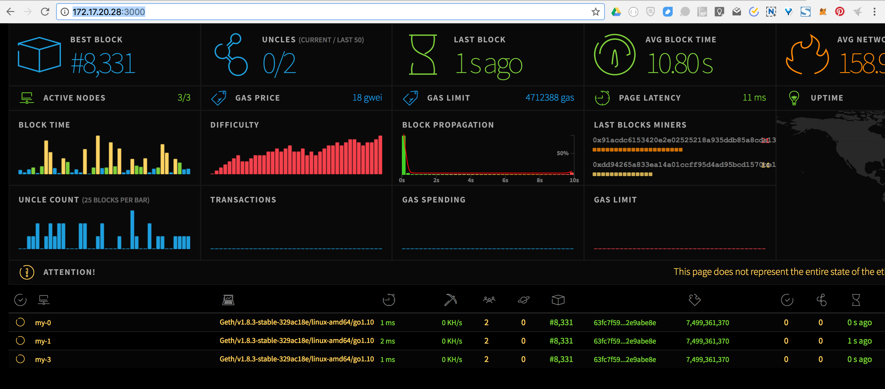

# 以太坊集群监控（Network Status Monitoring）

远程使用云服务器，总是会有各种限制，因此本地使用Docker快速构建一套Ubuntu的环境，自由一些。

参考：

* https://github.com/ethereum/go-ethereum/wiki/Setting-up-monitoring-on-local-cluster
* https://github.com/ethereum/wiki/wiki/Network-Status
* https://github.com/cubedro/eth-netstats
* https://github.com/cubedro/eth-net-intelligence-api

## 开始

1. 以太坊集群监控有两个组件：

   - **eth-netstats**：前端画面显示
   - **eth-net-intelligence-api**：通过rpc接入以太坊集群，通过WebSocket把数据推送给前端

2. **eth-netstats**安装

   ```
   git clone https://github.com/cubedro/eth-netstats
   cd eth-netstats
   npm install

   PORT=3000 WS_SECRET=hello npm start
   ```

   缺省Ubuntu的nodejs版本太低，会出现语法错误。

   ```shell
   # 错误内容
   /home/ubuntu/eth-netstats/node_modules/primus/index.js:177
       const sandbox = Object.keys(global).reduce((acc, key) => {
       ^^^^^
   SyntaxError: Use of const in strict mode.
       at Module._compile (module.js:439:25)
       at Object.Module._extensions..js (module.js:474:10)
       at Module.load (module.js:356:32)
       at Function.Module._load (module.js:312:12)
       at Module.require (module.js:364:17)
       at require (module.js:380:17)
       at Object.<anonymous> (/home/ubuntu/eth-netstats/app.js:44:14)
       at Module._compile (module.js:456:26)
       at Object.Module._extensions..js (module.js:474:10)
       at Module.load (module.js:356:32)

   # 升级nodejs
   sudo npm cache clean -f
   sudo npm install -g n
   sudo n stable
   # 升级之后需要重新登录
   ```

   这个时候可以通过http://localhost:3000/访问eth-netstats，但是这个时候没有数据。

3. eth-net-intelligence-api**安装

   ```
   git clone https://github.com/cubedro/eth-net-intelligence-api
   cd eth-net-intelligence-api
   npm install
   sudo npm install -g pm2

   # 使用https://github.com/ethersphere/eth-utils的netstatconf.sh脚本生成需要运行的配置文件实例
   bash netstatconf.sh 5 mynode http://localhost:3000 big-secret > app.json
   ```

   app.json的例子：

   ```json
   [
     {
       "name"        : "my-1",
       "cwd"         : ".",
       "script"      : "app.js",
       "log_date_format"   : "YYYY-MM-DD HH:mm Z",
       "merge_logs"    : false,
       "watch"       : false,
       "exec_interpreter"  : "node",
       "exec_mode"     : "fork_mode",
       "env":
       {
         "NODE_ENV"    : "production",
         "RPC_HOST"    : "localhost",
         "RPC_PORT"    : "8001",
         "INSTANCE_NAME"   : "my-1",
         "WS_SERVER"     : "http://localhost:3000",
         "WS_SECRET"     : "hello",
       }
     },
   ]

   # WS_SERVER： 上面eth-netstats运行的地址
   # WS_SECRET:  上面WS_SECRET运行时设置的Secret
   # RPC_HOST：  geth运行的时候rpc对应地址(geth运行宿主机的地址)
   # RPC_PORT：  geth运行的时候rpc对应的Port
   ```

   设置完成之后，运行：

   ```
   pm2 start app.json
   # 如果需要删除之前的运行实例，需要执行 pm2 kill
   ```

   这个时候可以通过http://localhost:3000/访问eth-netstats，刷新后会发现数据出来了。

   


TODO： 需要解读eth-netstats画面的数据内容，已经程序架构。


